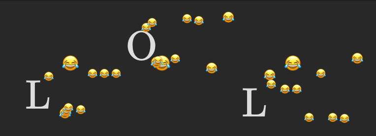

# zalgo-emoji
emoji-fied zalgo text using latex rendering. Intended for use in mattermost.



# Example
Paste the output of 
```
python zalgo-emoji.py -i "cool, thanks" -n 15 --font-size Large --emoji 😎 👍
```
into mattermost, making sure to wrap it in 
````
```latex
PASTE HERE
```
````
which will look something like this:
````
```latex
{ { { { { \overset{ \underset{ \overset{ \overset{ { \underset{ { \underset{ \overset{ { \text{ {\Large c } } }^{ 😎 } }{ 😎 } }{ 😎 } }^{ 👍 } }{ 😎 } }_{ 😎 } }{ 👍 } }{ 😎 } }{ 😎 } }{ 😎 } }^{ 😎 } }_{ 😎 } }_{ 😎 } }^{ 👍 } }^{ 😎 }{ \overset{ { { \underset{ \overset{ \overset{ { \overset{ \underset{ \underset{ { { { { \text{ {\Large o } } }_{ 😎 } }_{ 👍 } }_{ 👍 } }_{ 👍 } }{ 👍 } }{ 👍 } }{ 😎 } }_{ 😎 } }{ 😎 } }{ 👍 } }{ 😎 } }^{ 😎 } }_{ 👍 } }{ 👍 } }_{ 😎 }\underset{ { \overset{ { \overset{ { { \overset{ \underset{ { \overset{ \overset{ \overset{ \overset{ \overset{ \text{ {\Large o } } }{ 👍 } }{ 👍 } }{ 👍 } }{ 👍 } }{ 😎 } }_{ 😎 } }{ 👍 } }{ 👍 } }^{ 👍 } }^{ 👍 } }{ 👍 } }^{ 😎 } }{ 👍 } }^{ 😎 } }{ 👍 }{ \underset{ \underset{ \overset{ \overset{ \underset{ { { { { { \underset{ { \overset{ { \text{ {\Large l } } }^{ 👍 } }{ 👍 } }_{ 😎 } }{ 😎 } }^{ 😎 } }^{ 😎 } }^{ 😎 } }^{ 😎 } }^{ 😎 } }{ 👍 } }{ 😎 } }{ 😎 } }{ 😎 } }{ 😎 } }^{ 😎 }{ { \overset{ { \overset{ \underset{ \overset{ { \underset{ \overset{ { { \overset{ \underset{ \overset{ \text{ {\Large , } } }{ 👍 } }{ 😎 } }{ 👍 } }_{ 😎 } }^{ 😎 } }{ 👍 } }{ 😎 } }^{ 👍 } }{ 👍 } }{ 😎 } }{ 😎 } }^{ 👍 } }{ 👍 } }^{ 👍 } }_{ 😎 }\overset{ \overset{ \overset{ { { \underset{ { \overset{ \overset{ \overset{ \overset{ \overset{ { \underset{ { \text{ {\Large   } } }^{ 👍 } }{ 👍 } }^{ 😎 } }{ 😎 } }{ 👍 } }{ 👍 } }{ 👍 } }{ 👍 } }_{ 😎 } }{ 👍 } }^{ 👍 } }_{ 👍 } }{ 👍 } }{ 👍 } }{ 😎 }{ \underset{ { { \underset{ { { { \overset{ \underset{ { { \underset{ { \overset{ \text{ {\Large t } } }{ 😎 } }_{ 😎 } }{ 😎 } }^{ 😎 } }^{ 👍 } }{ 😎 } }{ 👍 } }_{ 👍 } }^{ 😎 } }_{ 👍 } }{ 👍 } }_{ 👍 } }_{ 👍 } }{ 😎 } }_{ 👍 }\underset{ { { \overset{ { \overset{ \underset{ { \underset{ \underset{ \overset{ { { { \underset{ \text{ {\Large h } } }{ 👍 } }^{ 😎 } }^{ 👍 } }^{ 😎 } }{ 👍 } }{ 😎 } }{ 😎 } }_{ 😎 } }{ 😎 } }{ 👍 } }_{ 👍 } }{ 😎 } }_{ 😎 } }^{ 👍 } }{ 👍 }\underset{ \overset{ \underset{ { \overset{ \overset{ \overset{ \underset{ { \underset{ \overset{ \overset{ \underset{ \underset{ \overset{ \text{ {\Large a } } }{ 👍 } }{ 👍 } }{ 😎 } }{ 👍 } }{ 👍 } }{ 👍 } }_{ 👍 } }{ 😎 } }{ 👍 } }{ 👍 } }{ 😎 } }^{ 😎 } }{ 😎 } }{ 👍 } }{ 😎 }\underset{ { \overset{ { \overset{ \overset{ \underset{ { \underset{ { \underset{ \underset{ { \underset{ { \text{ {\Large n } } }_{ 😎 } }{ 😎 } }^{ 👍 } }{
👍 } }{ 👍 } }_{ 😎 } }{ 😎 } }_{ 😎 } }{ 😎 } }{ 😎 } }{ 👍 } }^{ 👍 } }{ 😎 } }^{ 👍 } }{ 👍 }{ \overset{ \overset{ \overset{ { { { \underset{ { \overset{ \overset{ \underset{ { \overset{ { \text{ {\Large k } } }^{ 👍 } }{ 😎 } }^{ 👍 } }{ 👍 } }{ 👍 } }{ 😎 } }^{ 😎 } }{ 👍 } }^{ 😎 } }^{ 😎 } }^{ 👍 } }{ 👍 } }{ 😎 } }{ 😎 } }^{ 😎 }{ \overset{ { \underset{ \overset{ \underset{ { { \overset{ { \underset{ \overset{ { { { \text{ {\Large s } } }^{ 👍 } }_{ 😎 } }^{ 👍 } }{ 😎 } }{ 😎 } }^{ 😎 } }{ 😎 } }_{ 👍 } }_{ 👍 } }{ 😎 } }{ 👍 } }{ 😎 } }^{ 😎 } }{ 👍 } }_{ 👍 }
```
````

Suggestion: send yourself the message first to make sure it renders as expected. Occasionally, the script outputs things that the latex renderer doesn't like. 
